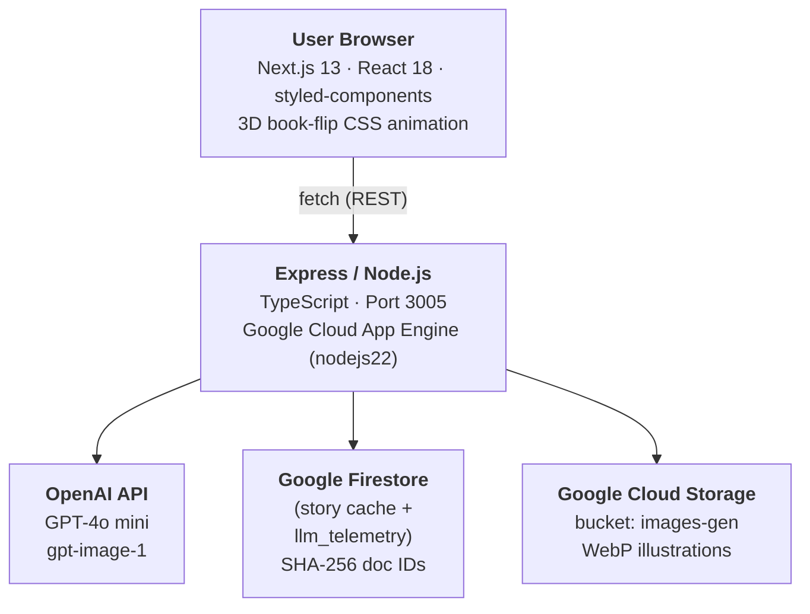

# Fábula Infantil ✨

> AI-powered interactive children's storytelling — personalized stories with branching choices and illustrations, presented as a 3D animated book.

**Live at → [fabulainfantil.com](https://fabulainfantil.com)**

---

## What It Does

Children (ages 0–14) pick an age group and a theme keyword. The app then:

1. Generates the **opening** of a story using GPT-4o mini
2. Presents **3 branching choices** for how the story continues
3. Repeats for Part 2 and the finale (Part 3)
4. Assembles the full story into an **animated 3D book** with AI-generated illustrations
5. Lets the user **share** the story via a unique link with full Open Graph support

Each story is unique, fully in Brazilian Portuguese, and age-appropriate.

---

## Architecture



---

## Tech Stack

### Backend (`/back-end`)

| | |
|---|---|
| Runtime | Node.js 22 + TypeScript |
| Framework | Express 4 |
| AI Text | OpenAI `gpt-4o-mini` |
| AI Images | OpenAI `gpt-image-1` (1024×1024 WebP) |
| Database | Google Cloud Firestore |
| Storage | Google Cloud Storage (`images-gen` bucket) |
| Deployment | Google Cloud App Engine |

### Frontend (`/front-end-2`)

| | |
|---|---|
| Framework | Next.js 13.2 (Pages Router) |
| UI | React 18 + styled-components |
| Analytics | Google Analytics 4 + Vercel Analytics |
| Deployment | Vercel |

---

## API Reference

| Method | Endpoint | Description |
|---|---|---|
| `POST` | `/generate/:keyword/:ageGroup` | Generate story part (GPT-4o mini) |
| `POST` | `/generateImage` | Generate illustration (gpt-image-1 → GCS) |
| `POST` | `/shareStory` | Save story to Firestore, return `storyId` |
| `GET` | `/shareStory/:storyId` | Retrieve shared story (EJS, OG tags) |
| `GET` | `/internal/llm-metrics` | 24h LLM telemetry aggregates — gated by `X-Internal-Key` header, polled by `monitoring-links` |

**Age groups:** `0_2`, `3_5`, `6_8`, `9_11`, `12_14`

**Image body:** `{ "prompt": "<string>" }`

**Story body:** `{ "messages": [...] }` — conversation history for multi-turn context

---

## Project Structure

```
FabulaInfrantil/
├── back-end/
│   ├── controllers/          # Request handlers
│   │   ├── generate.controller.ts
│   │   ├── generateImage.controller.ts  # Uploads to GCS, returns public URL
│   │   └── shareStory.controller.ts
│   ├── services/             # OpenAI API calls + exponential backoff (5 retries)
│   ├── repository/           # Firestore + GCS read/write
│   ├── routes/               # Express route definitions
│   ├── interfaces/           # IMessage, IBody
│   ├── utils/                # SHA-256 hashing, sleep helper
│   ├── public/               # EJS template (social share page)
│   └── app.yaml              # App Engine config (nodejs22)
│
└── front-end-2/
    ├── pages/
    │   └── index.tsx         # Main app — all story state, 3D book UI
    ├── components/
    │   ├── SpinnerAnimation.tsx  # Loading screen with PT-BR phrases
    │   ├── Modal.tsx             # Fullscreen image viewer
    │   └── GoogleAnalytics.tsx
    ├── helpers/
    │   └── fetchHelper.ts    # Typed fetch wrappers with exponential backoff
    └── interfaces/
```

---

## Local Development

### Backend

```bash
cd back-end
npm install
```

Create `back-end/.env`:

```env
OPENAI_API_KEY=sk-...
APP_CRED=./path/to/gcp-service-account.json
GOOGLE_CLOUD_PROJECT=your-gcp-project-id
FONTEND_SRV=http://localhost:3006
INTERNAL_API_KEY=<shared secret for GET /internal/llm-metrics>
```

```bash
npm run dev        # TypeScript watch + nodemon on :3005
```

### Frontend

```bash
cd front-end-2
npm install
```

Create `front-end-2/.env.local`:

```env
NEXT_PUBLIC_BACKEND_SRV=http://localhost:3005
NEXT_PUBLIC_GA_ID=G-XXXXXXXXXX
```

```bash
npm run dev        # Next.js dev server on :3006
```

---

## How Story Generation Works

Each story part is a **multi-turn conversation** with GPT-4o mini. The system prompt instructs the model to:

- Generate age-appropriate content in Brazilian Portuguese
- Produce up to 200 words per part
- Always end with exactly 3 labeled branching options ("Opção 1 / 2 / 3")
- Continue the narrative based on the user's chosen option

The full conversation history is passed on every request, giving the model context of all previous choices.

---

## Image Generation Flow

```
Frontend: POST /generateImage { prompt }
    │
    ▼
Backend: openai.images.generate({ model: "gpt-image-1", size: "1024x1024", output_format: "webp" })
    │
    ▼ b64_json (WebP)
Backend: Upload Buffer → GCS bucket images-gen/temp/{uuid}.webp
    │
    ▼ public GCS URL
Frontend: 
    │
    ▼ on share
Backend: Download temp image → re-upload to images-gen/{storyId}/image-{1,2,3}.webp
```

---

## Sharing

Shared stories are accessible at:

```
https://story.fabulainfantil.com/shareStory/{storyId}
```

The story ID is a **SHA-256 hash** of the story content, making it deterministic and cache-friendly. The share page is rendered server-side with EJS and includes full Open Graph meta tags for rich link previews on social media.

---

## Deployment

### Backend → Google Cloud App Engine

```bash
cd back-end
npm run build
gcloud app deploy
```

### Frontend → Vercel

Push to the connected GitHub repo — Vercel deploys automatically.

---

## CORS Policy

| Origin | Access |
|---|---|
| `http://localhost:3006` | All routes |
| `https://fabulainfantil.com` | All routes |
| `https://fabulainfantil.com.br` | All routes |
| `*` | `/shareStory/*` (public, for social crawlers) |
| `*` (no `Origin` header) | `/internal/*` (server-to-server; gated by `X-Internal-Key` header instead of CORS) |

---

## Environment Variables Summary

| Variable | Where | Description |
|---|---|---|
| `OPENAI_API_KEY` | Backend | OpenAI API key |
| `APP_CRED` | Backend | Path to GCP service account JSON |
| `GOOGLE_CLOUD_PROJECT` | Backend | GCP project ID |
| `FONTEND_SRV` | Backend | Frontend origin URL |
| `INTERNAL_API_KEY` | Backend | Shared secret checked against the `X-Internal-Key` header on `GET /internal/llm-metrics` |
| `NEXT_PUBLIC_BACKEND_SRV` | Frontend | Backend base URL |
| `NEXT_PUBLIC_GA_ID` | Frontend | Google Analytics 4 measurement ID |

<!-- phase7b-e2e 1785079413856 -->
